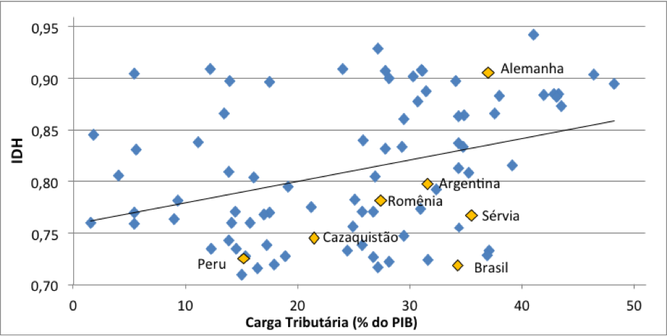

\addtolength{\headheight}{0.0cm} 
\pagestyle{fancyplain} 
\lhead{\includegraphics[height=1.5cm]{LogoIME.png}}
\rhead{\includegraphics[height=1.5cm]{images.jpeg}}
\chead{UNIVERSIDADE FEDERAL DO RIO GRANDE DO SUL \\
INSTITUTO DE MATEMÁTICA E ESTATÍSTICA \\
DEPARTAMENTO DE ESTATÍSTICA \\
\vspace{0.3cm}
MAT02215 - Estatística Geral 2 - 2020/1
}
\renewcommand{\headrulewidth}{0pt} 


```{r setup, include=FALSE}
knitr::opts_chunk$set(echo = TRUE)
```

## (...continuação) Regressão Linear Simples (Bussab e Morettin - capítulo 16)

* **Exemplo 1**: O Índice de Desenvolvimento Humano (IDH) em países pode estar associado à carga tributária?  
<!-- { width=40% }   -->

<!-- Artigo de 2012: https://carodinheiro.blogfolha.uol.com.br/2012/12/14/pagamento-de-impostos-no-brasil-e-um-investimento-sem-retorno/ -->

<!-- \vspace{0.2cm} -->

* **Exemplo 2**: O valor do auxílio estudantil oferecido por uma universidade pode estar relacionado com a renda familiar dos estudantes?

```{r college_aid, message=FALSE, echo=FALSE, warning=FALSE, fig.width=3, fig.height=2, fig.align='center'}
library(ggplot2)
library(openintro)
data(COL)
data(elmhurst)
d <- elmhurst

g <- lm(d$gift_aid ~ d$family_income)


loss <- function(a, b, d) {
  p <- a + b * d$family_income
  sum(abs(d$gift_aid - p))
}
a      <- round(g$coef[1], 2) + seq(-0.5, 0.5, 0.001)
b      <- round(g$coef[2], 3) + seq(-0.01, 0.01, 0.0001)
mins   <- c(a[1], b[1])
theMin <- loss(a[1], b[1], d)
pb     <- txtProgressBar(1, length(a), style=3)
for (i in 1:length(a)) {
  for (j in 1:length(b)) {
    hold <- loss(a[i], b[j], d)
    if (hold < theMin) {
      mins <- c(a[i],b[j])
      theMin <- hold
    }
  }
}

# elmhurstScatterW2Lines

ggplot(data = d, mapping = aes(family_income, gift_aid)) +
  theme(panel.border = element_rect(colour = "black", fill = NA, size = 1)) +
  geom_point(color = 'skyblue3') +
  labs(x = 'Renda Familiar ($1000s)', y = 'Auxílio da \nuniversidade ($1000s)') +
  geom_abline(slope = mins[2], intercept = mins[1], linetype = 'dashed', size = 1) +
  geom_smooth(formula = y ~ x, se = FALSE, method = 'lm', color = 'black')
```


\vspace{0.5cm}

## Tópicos importantes na prática:

### Avaliação dos modelos  (Bussab e Morettin - seção 16.3)
* ANOVA na regressão

### **Análise dos resíduos** (Bussab e Morettin - seção 16.5)
$e_i = y_i - \widehat y_i$ nos informa os desvios de $y_i$ que não são explicados pelo modelo $\widehat y_i$.

* Quais as suposições para os resíduos $e_i$?
* Como testar/verificar as suposições?

### Modelos especiais
* Modelos não lineares (Bussab e Morettin - seção 16.6.2)
    + transformaçções nas variáveis para linearização.


### Uso de software?
* Códigos em `R` podem ser obtidos na página 'Probabilidade e Estatística (EaD)' da UFRGS.

No `R`, o comando 'lm(y ~ x)' (de *linear model*) ajusta a reta de regressão 'y ~ x', para dois vetores 'y' e 'x', e fornece resultados dos testes.

* ** (...continuação) Exemplo 2**: 

```{r college_aid_lm, message=FALSE, echo=FALSE, warning=FALSE}
summary(g)
```

* Aplicativos na internet

<!-- https://artofstat.com/web-apps -->


# Para a prova 3
* Ter o formulário em mãos.

**Importante lembrar**:

* Suposições necessárias para os testes Qui Quadrado, decorrelação e regressão.
    + análise de resíduos
* Decisão/Conclusão dos testes e interpretação de coeficientes.
* Valor *p*,  para os testes Qui Quadrado de correlação e na regressão também.

\vspace{0.2cm}

* Correlação espúria

\vspace{0.2cm}

* Causalidade e correlação

\vspace{1.0cm}

* Causalidade e correlação

\vspace{1.0cm}

## REFERÊNCIA EXTRA
Página 'Probabilidade e Estatística (EaD)' da UFRGS

* [Capítulo 7 - Introdução à Regressão Linear](https://www.ufrgs.br/probabilidade-estatistica/livro/cpt7/ch7_reg_simples.html#pref%C3%A1cio)

\vspace{0.5cm}

***
<!-- ### Ler slides das aulas 27 e 28 -->
<!-- ### Continuar exercícios da lista 3-3 -->
### Fazer avaliação parcial da ára 3
***
